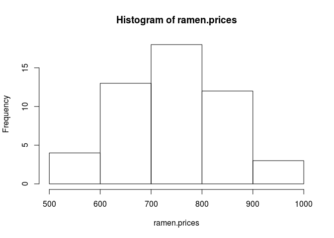

第2章 データ全体の雰囲気をつかもう！ 数量データ編
=================================================

1. 度数分布表とヒストグラム
---------------------------

「美味しいラーメンbest 50」に掲載されているラーメン屋のラーメンの値段

``` r
ramen.prices <- c(700, 850, 600, 650, 980, 750, 500, 890, 880, 700,
                  890, 720, 680, 650, 790, 670, 680, 900, 880, 720,
                  850, 700, 780, 850, 750, 780, 590, 650, 580, 750,
                  800, 550, 750, 700, 600, 800, 800, 880, 790, 790,
                  780, 600, 670, 680, 650, 890, 930, 650, 777, 700)
```

ヒストグラムを描画

``` r
hist(ramen.prices, right = FALSE, breaks = 5)
```



2. 平均
-------

ボーリング大会の結果

``` r
bowling.team.a <- c(86, 73, 124, 111, 90, 38)
bowling.team.b <- c(84, 71, 103, 85, 90, 89)
bowling.team.c <- c(229, 77, 59, 95, 70, 88)
```

Aチームの平均

``` r
mean(bowling.team.a)
```

    ## [1] 87

Bチームの平均

``` r
mean(bowling.team.b)
```

    ## [1] 87

Cチームの平均

``` r
mean(bowling.team.c)
```

    ## [1] 103

3. 中央値
---------

Aチームの中央値

``` r
median(bowling.team.a)
```

    ## [1] 88

Bチームの中央値

``` r
median(bowling.team.b)
```

    ## [1] 87

Cチームの中央値

``` r
median(bowling.team.c)
```

    ## [1] 82.5

4. 標準偏差
-----------

標準偏差の式

``` r
standard.deviation <- function(values) {
    m <- mean(values)
    sqrt(sum((values - m)^2) / length(values))
}
```

備考: Rには標準偏差を計算する関数`sd`がある。`sd`はp. 52で紹介されている分母が(データの個数 - 1)の式で計算する。

Aチームの標準偏差

``` r
standard.deviation(bowling.team.a)
```

    ## [1] 27.5439

Bチームの標準偏差

``` r
standard.deviation(bowling.team.b)
```

    ## [1] 9.469248

Cチームの標準偏差

``` r
standard.deviation(bowling.team.c)
```

    ## [1] 57.54129

例題
----

100m走の結果

``` r
race.times <- c(16.3, 22.4, 18.5, 18.7, 20.1)
```

-   平均
-   中央値
-   標準偏差
