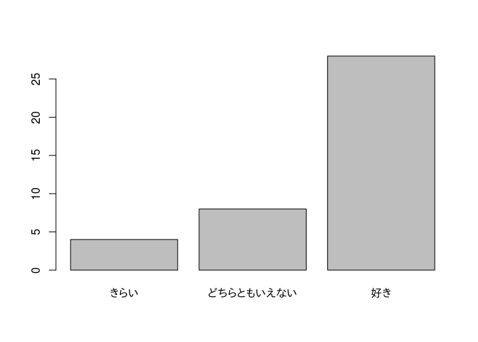

# 第3章 データ全体の雰囲気をつかもう！ カテゴリーデータ編

## 1. 単純集計表

新しい制服のデザインアンケート

``` r
school.uniform.survey <- c("好き", "どちらともいえない", "好き",
                           "どちらともいえない", "きらい", "好き", "好き",
                           "好き", "好き", "好き", "好き", "好き",
                           "どちらともいえない", "好き", "好き",
                           "どちらともいえない", "好き", "好き", "好き", "好き",
                           "好き", "好き", "きらい", "どちらともいえない",
                           "好き", "好き", "きらい", "好き", "好き", "好き",
                           "どちらともいえない", "どちらともいえない", "好き",
                           "きらい", "好き", "好き", "好き", "好き",
                           "どちらともいえない", "好き")
```

度数の集計

``` r
table(school.uniform.survey)
```

    ## school.uniform.survey
    ##             きらい どちらともいえない               好き 
    ##                  4                  8                 28

プロット

``` r
barplot(table(school.uniform.survey))
```



割合の集計

``` r
prop.table(table(school.uniform.survey))
```

    ## school.uniform.survey
    ##             きらい どちらともいえない               好き 
    ##                0.1                0.2                0.7

## 例題

△△党についてのアンケート結果

``` r
party.survey <- c("期待できない", "期待できない", "期待できない",
                  "どちらともいえない", "期待できる", "期待できない",
                  "期待できる", "どちらともいえない", "期待できない",
                  "期待できない")
```
