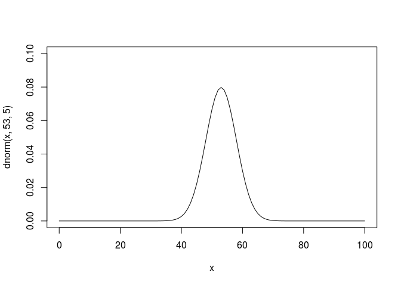
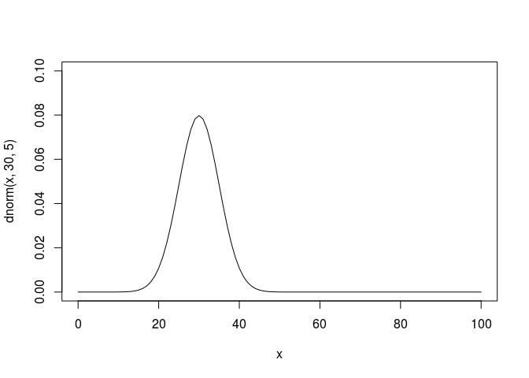

# 第5章 確率を求めよう！

## 1. 確率密度関数

A県の高校3年生全員の英語のテスト結果 (乱数で生成)

``` r
set.seed(0)
english.scores <- rnorm(10000, 53, 10)
```

階級の幅と「英語のテスト結果」のヒストグラム

階級の幅が10

``` r
hist(english.scores, breaks = 100 / 10)
```


階級の幅が5

``` r
hist(english.scores, breaks = 100 / 5)
```


階級の幅が3

``` r
hist(english.scores, breaks = 100 / 3)
```


## 2. 正規分布

平均が53で標準偏差が15

``` r
curve(dnorm(x, 53, 15), 0, 100, ylim = c(0, 0.1))
```


平均が53で標準偏差が5

``` r
curve(dnorm(x, 53, 5), 0, 100, ylim = c(0, 0.1))
```



平均が30で標準偏差が5

``` r
curve(dnorm(x, 30, 5), 0, 100, ylim = c(0, 0.1))
```



## 3. 標準正規分布

標準正規分布のグラフの0から1.96までの面積を求める。

`pnorm`関数

``` r
pnorm(1.96)
```

    ## [1] 0.9750021

本の標準正規分布表は0からzまでの面積、それに対して`pnorm`は左端(-無限大)からzまでの面積を返す。なので合わせるには0.5を引く。

``` r
pnorm(1.96) - 0.5
```

    ## [1] 0.4750021

## 4. カイ二乗分布

自由度2

``` r
curve(dchisq(x, 2), 0, 20)
```


自由度10

``` r
curve(dchisq(x, 10), 0, 40, ylim = c(0, 0.1))
```


自由度20

``` r
curve(dchisq(x, 20), 0, 40, ylim = c(0, 0.1))
```


自由度が1でPが0.05の場合のカイ二乗の値は

``` r
qchisq(0.05, df = 1, lower.tail = FALSE)
```

    ## [1] 3.841459
