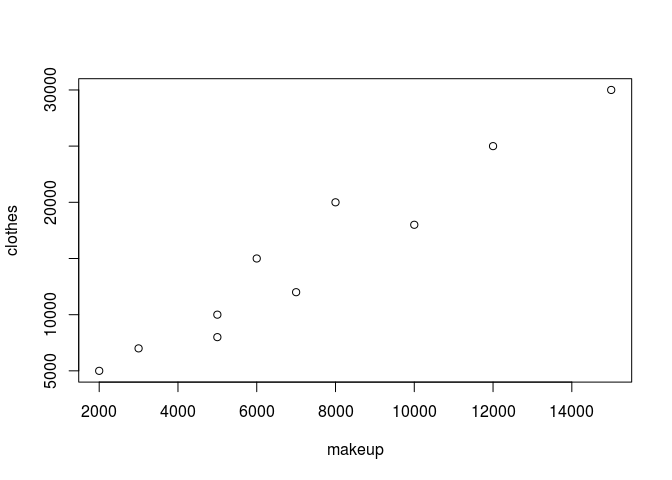
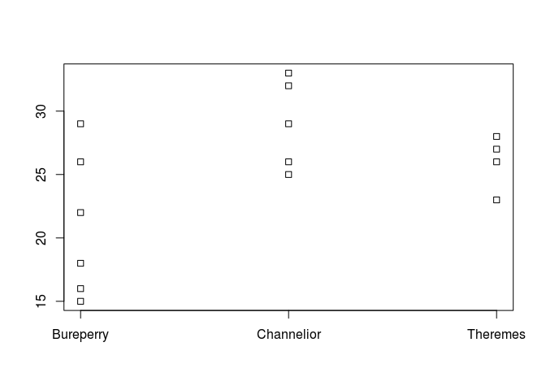

# 第6章 2変数の関連を調べよう！

## 1. 単相関係数

化粧品代と洋服代のアンケート結果

``` r
makeup <- c(3000, 5000, 12000, 2000, 7000, 15000, 5000, 6000, 8000, 10000)
clothes <- c(7000, 8000, 25000, 5000, 12000, 30000, 10000, 15000, 20000, 18000)
```

グラフ

``` r
plot(makeup, clothes)
```



単相関係数

``` r
cor(makeup, clothes)
```

    ## [1] 0.9680196

## 2. 相関比

年齢と好きな洋服のブランド

``` r
survey.age <- c(27, 33, 16, 29, 32, 23, 25, 28, 22, 18, 26, 26, 15, 29, 26)
survey.brand <- c("Theremes", "Channelior", "Bureperry", "Bureperry", "Channelior", "Theremes",
                  "Channelior", "Theremes", "Bureperry", "Bureperry", "Channelior", "Theremes",
                  "Bureperry", "Channelior", "Bureperry")
```

集計

``` r
split(survey.age, survey.brand)
```

    ## $Bureperry
    ## [1] 16 29 22 18 15 26
    ## 
    ## $Channelior
    ## [1] 33 32 25 26 29
    ## 
    ## $Theremes
    ## [1] 27 23 28 26

グラフ

``` r
stripchart(split(survey.age, survey.brand), vertical = TRUE)
```



相関比を求める関数

``` r
correlation.ratio <- function(value, category) summary(lm(value ~ category))$r.squared
```

相関比

``` r
correlation.ratio(survey.age, survey.brand)
```

    ## [1] 0.4455446

## 3. クラメールの連関係数

クロス集計表

``` r
asked.out.table <- matrix(c(34, 61, 53, 38, 40, 74), byrow = TRUE, nrow = 2)
```

``` r
asked.out.table
```

    ##      [,1] [,2] [,3]
    ## [1,]   34   61   53
    ## [2,]   38   40   74

今回は[vcdパッケージ](https://cran.r-project.org/web/packages/vcd/index.html)を使ってクラメールの連関係数を計算する。

パッケージのインストール

``` r
install.packages("vcd")
```

パッケージの読み込み

``` r
library(vcd)
```

計算

``` r
assocstats(asked.out.table)
```

    ##                     X^2 df P(> X^2)
    ## Likelihood Ratio 8.0558  2 0.017812
    ## Pearson          8.0091  2 0.018233
    ## 
    ## Phi-Coefficient   : NA 
    ## Contingency Coeff.: 0.161 
    ## Cramer's V        : 0.163

クラメールの連関係数のみを取り出す

``` r
assocstats(asked.out.table)$cramer
```

    ## [1] 0.1633921
